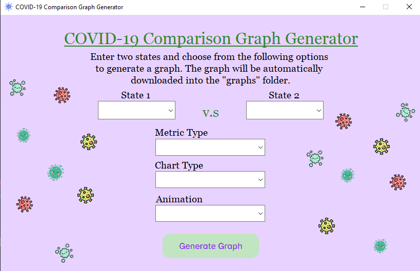

# COVID-19 Comparison Graph Generator

A simple program with a GUI that generates a graph comparing two U.S. states. The options include line, bar, and pie charts. The output can be animated or just an image file.

There are four metric types: 

- Total Cumulative COVID-19 Cases
- Daily New COVID-19 Cases (Rolling Avg. of 7 Days)
- Total Cumulative COVID-19 Deaths
- Daily New COVID-19 Deaths (Rolling Avg. of 7 Days)

### Usage

Run `gui.py` to open the GUI. Choose from the available options and the generated graph will be a in the corresponding  `/graphs` folder.

### Demo

	
	

	
	

#### All examples are in `/graphs` folder.

